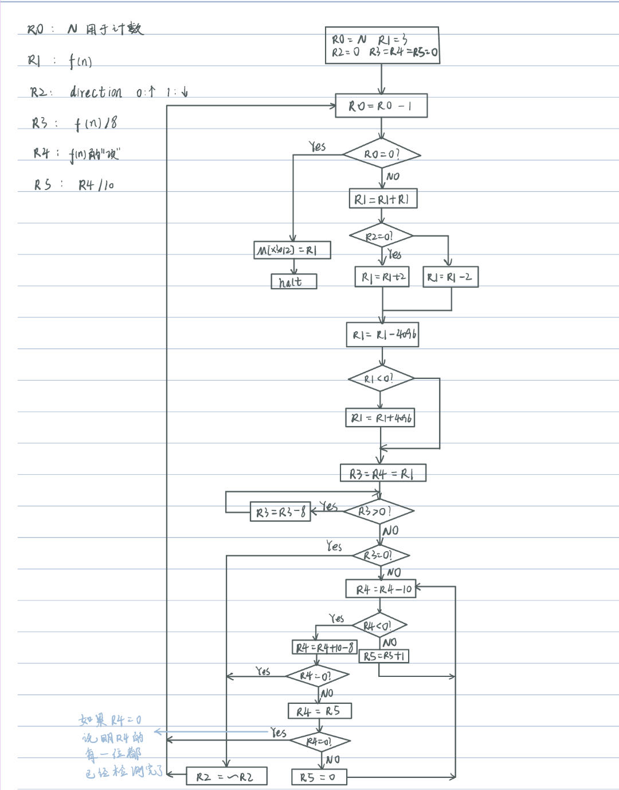

# Lab02: The PingPong Sequence

PB22081571 薄震宇

## 实验目的

本次实验的目的在于运用汇编语言求出乒乓序列，其中涉及到取模，求商等复杂运算和多次条件跳转，由此可以更加熟练的掌握汇编语言。同时本次实验可以分成几个模块（初始化->求出f(n)->判断direction是否发生改变）来实现，由此可以锻炼我们处理复杂问题的能力，即把一个复杂的问题拆分成几个简单的问题分模块处理。

## 实验原理

正如上面所提到的，本次实验可以分成三个小问题来处理：

1. 初始化所有需要用到变量，存放在寄存器中
2. 更新f(n)，并且判断是否越界即是否大于4096，若越界则需要取其对4096的模，这里因为f(1)=3,每次发现f(n)大于4096时，直接减去4096即可保证f(n)始终在指定范围内
3. 根据f(n)的值判断是否要将direction取反。

第三步涉及到了取模，求商等复杂的运算，下面讨论如何实现；

例如判断f(n)是否为8的倍数，我们需要将f(n)对8取模，然后判断模数是否为0。这里可以再用一个寄存器（我的实验中用的是`R3`，这里就以`R3`为例）存放f(n)的值，然后设计一个循环：先判断R3是否大于0，若大于0，则减去8，再判断，直至R3小于或等于0。此时再判断R3是否等于0，若等于0，则说明f(n)可以分成整数个8相加，它是8的倍数，否则不是。

此外本次实验还需要求商，因为在判断f(n)的十进制表示中是否有一位为8时，需要不断的求它除以10的商。这里可以使用两个寄存器，一个存放f(n)，一个存放f(n)除以10的商。我的实验中用的是`R4`，`R5`，所以这里就以这两个寄存器为例。R5初始化为0，R4初始化为f(n),然后不断的将R4减去10，若`R4 > 0`，则`R5 = R5 + 1`，直至R4小于0，如此便可得到R4除以10的商，而`R4 + 10`即为余数，若余数等于8，则翻转direction，否则将R4更新为R5中的值，R5再次赋值为0，然后再进行求商，取模，判断……
如果f(n)的每一位都不为8，那么最终R5会等于0，R4 - 10后不等于8，然后更新为R5，R4也会等于0，这就是循环终止的条件。

下面为本次实验的流程图：


## 程序实现

按照上面的思路，先写出C语言代码检验思路的正确性，同时也可以后续验证结果是否正确：

```C
#include<stdio.h>
#include<stdlib.h>

int main()
{
    int n,f = 3, direction = 0,temp,temp_f;
    printf("请输入n:\n");
    scanf("%d",&n);
    for(n--;n > 0;n--)
    {
        f = direction ? (f * 2 - 2) : (f * 2 + 2);
        if(f > 4096)
            f = f - 4096;
        if(f % 8 == 0)
        {
            direction = !direction;
        }
        else
        {
            temp_f = f;
            do
            {
                temp = temp_f / 10;
                temp_f = temp_f % 10;
                if(temp_f == 8)
                {
                    direction = !direction;
                    break;
                }
                else
                {
                    temp_f = temp;
                }
            } while(temp);
        }       
    }
    printf("%d",f);
    return 0;
}
```

运行结果：


结果正确！

然后可以用汇编语言写出代码：

```asm
;本题关键在于direction的变换，可以先判断f(n)是否为8的倍数，再判断其十进制表示的数中是否有一位是8
;在这个过程中如果满足任何一个条件，则diretion翻转，跳出判断，计算f(n+1)
;这里判断是否为8的倍数及位数是否为8都可以通过减法来求对8或10的余数和对10的商
;在判断direction是否要发生改变之前，需要先根据drection的值对f(n)做出相应的改变，并且还要判断f(n)是否越界
;如果超过4096，需要减去4096。因为f(1)=3,每次发现f(n)大于4096时，都会减去4096
;所以f(n)大于4096时，不会比4096的二倍还大，所以只需要减去一次4096即可

;Initialization
;
            .ORIG   x3000
            AND     R1, R1, #0      ;R1用于存储f(n)的值
            AND     R2, R2, #0      ;R2用于存储direction，R2=0时表示向上的箭头，否则表示向下的
            AND     R3, R3, #0      ;R3用于计算f(n)是否为8的倍数
            AND     R4, R4, #0      ;R4用于存储f(n)的十进制表示的每一项，以判断f(n)的十进制表示是否含有8
            AND     R5, R5, #0      ;R5用于存储R4/10的值，用于更新R4中的值
            LD      R6, PTR1        ;R6中存储PTR1(x3103)以备使用
            LD      R7, PTR2        ;R7中存入PTR2(4096)
            LDR     R0, R6, #-1     ;R0用于存储N，假设N存储在x3102中
            ADD     R1, R1, #3      ;R1初始化为3
            
;
;先改变R1的值，得到新的f(n),需要注意的是
;
CHANGER0    ADD     R0, R0, #-1     ;更新R0中的值
            BRz     STF             ;如果R1=0，说明计算完成，转到STF存储f(n)
            ADD     R1, R1, R1      ;R1 = 2*R1
            ADD     R1, R1, #2      ;先将R1加2，后面再根据R2中的值选择是否将R1减4
            ADD     R2, R2, #0      ;进行运算R2=R2,使得此时的nzp与R2中的值相关
            BRz     SubMod          ;如果R2=0,则不需要将R1减4
            ADD     R1, R1, #-4     ;如果R2!=0,则应将R1减2，由于已经将R1加2，所以减4
SubMod      NOT     R7, R7
            ADD     R7, R7, #1      ;将R7取反加1
            ADD     R1, R1, R7
            NOT     R7, R7
            ADD     R7, R7, #1      ;还原R7
            ADD     R1, R1, #0      ;R1 <- R1+0,使得此时nzp与R1相关
            BRzp    PART2           ;如果R1-4096>=0,则现在的R1即为指定范围内的R1,不需要再改变
            ADD     R1, R1, R7   ;如果R1-4096<0，说明原先的R1未越界，还原R1
;因为初始的R1为3，所以上述操作只需要执行一次就可以确保R1在范围内
;
;再判断是否要改变direction的方向
;
PART2       ADD     R4, R1, #0      ;R4 <- R1
            ADD     R3, R1, #0      ;R3 <- R1
JUDGE1      BRnz    JUDGE2
            ADD     R3, R3, #-8
            BRnzp   JUDGE1          ;R3-8后再判断是否为正
JUDGE2      BRz     CHANGER2        ;如果R3=0，说明R1是8的倍数，改变R2中的direction值
CHANGER4    ADD     R4, R4, #-10
            BRn     Add2            ;如果R4<0,判断余数是否为8
            ADD     R5, R5, #1      ;更新R5，用于保存R4/10
            BRnzp   CHANGER4
Add2        ADD     R4, R4, #2      ;如果R4<0,则先将R4加10得到余数，再减去8判断余数是否为8，相当于直接加2
            BRz     CHANGER2
            ADD     R4, R5, #0      ;R4 <- R5,相当于R4 <- R4/10
            BRz     RETURN          ;如果R4=0,说明R4的每一位都判断完了，返回最开始的CHANGER0
            AND     R5, R5, #0      ;R5重新赋值为0，准备计算R4的下一位
            BRnzp   CHANGER4        ;无条件跳转到CHANGER4
        

CHANGER2    NOT     R2, R2
RETURN      BRnzp   CHANGER0

STF         STR     R1, R6, #0      ;将结果存入x3103中
PTR1        .FILL   x3103           ;PTR1存储x3103
PTR2        .FILL   x1000           ;PTR2存储x1000(4096)
            HALT
            .END
```

过程中曾遇到的问题：
在判断f(n)是否越界时需要使用4096(x1000)这个数，但这又超出了立即数可表示的范围，所以起初我将4096这个数放在了内存中，然后将其读取到寄存器中，虽然解决了问题但是执行时还需要在内存中手动存入最大值4096，略显麻烦。后来使用了一个标签来指向4096，然后用`LD`指令将其读入到寄存器中，由此略为简单了一点，对应的代码部分如下：

```asm
             LD      R7, PTR2        ;R7中存入PTR2(4096)
PTR2        .FILL   x1000           ;PTR2存储x1000(4096)
```

## 运行结果

我检测了1，9，11，20这几个数来检测代码的正确性，其中f(11)，f(20)用于检测程序对于越界情况的处理,运行后寄存器和内存的状态如下：


这与手动计算出的结果相同（也与C语言实现的结果相同），故结果正确！

## 改进

问：如何优化程序中循环结构的效率？

1. 可以尽量将运算放在循环结构外面，减少内层的运算，与循环不相关的语句尽量放在循环外面。
2. 合理使用条件跳转语句，当满足条件时跳出循环，不再继续进行循环体中剩余的操作。例如判断是否要改变direction的方向时，一旦发现f(n)是8的倍数或是十进制表示中含有8，立即翻转R2，不再继续下面的判断。
3. 把简单的操作放在循环结构的前面，复杂的放在后面。例如在判断是否要改变direction的方向时，我先判断了f(n)是否为8的倍数，如果不是，再判断其十进制表示中是否含有8。因为判断倍数关系只涉及到取模，而后面判断f(n)十进制表示中是否含有8时则涉及到取模和求商，其中还包括众多条件判断，更为复杂。

## Something Interesting——序列的规律

修改上面的C语言代码，使它在计算f(N)时打印出出从f(1)到f(N)的每一项，这里我求出了f(n)的前200项来观察规律：


不难发现，从第五项开始，f(n)以`50  98  198  394  786  1574  3150  2206  318  634  1266  2530  962  1922  3842  3590  3086  2074`这样一段序列循环出现

观察更长的f(n)序列：


上述规律仍然适用

在本次实验中所指定的序列中，这个规律是普遍适用的。但是如果换一个变化的规则，显然它并不是普适的，例如将每次f(n)乘以2后再加或减1而不是加或减2，这个时候f(n)就不以上面的序列循环：


不难看出，这个f(n)也有自己的规律，即从第11项开始稳定在4095，但是与上面所说的规律不同。
