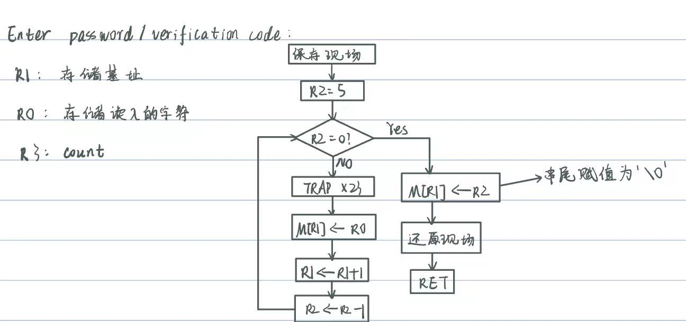
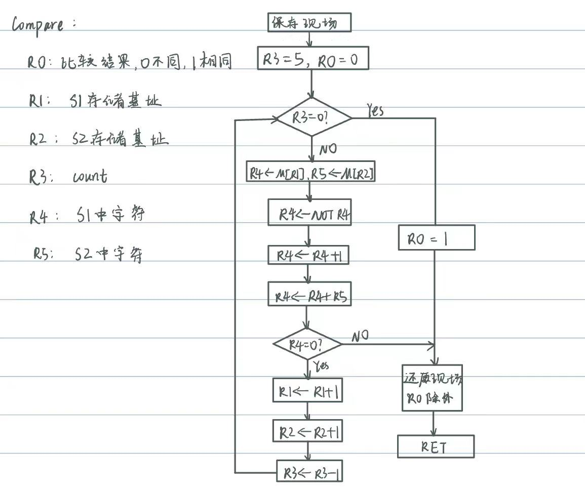
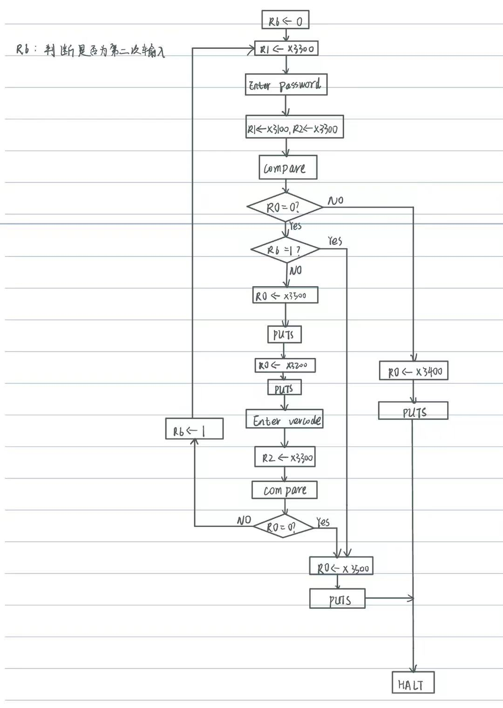

# lab3

## 实验目的

本次实验目的主要在于熟悉子程序的使用，通过调用子程序的方式将一个复杂的问题简单化，拆分成几个更为容易的小实验，对于一些重复出现的步骤也可以避免重复书写，直接调用相应的子程序即可。例如本次实验中我将实验中出现次数多的`compare`部分和`input`都写成了一个子程序，在需要时直接调用，如此便简化了实验，也使得逻辑上更为简单。

## 实验原理

正如上面所提到的，本次实验可拆分为几个子程序再在主体部分调用来处理。

1. 首先是读取输入的密码或是验证码的`input`子程序：

    因为用户知道密码和验证码都是五位并且输入的也是五位，所以可以用一个寄存器来计数，读取五个输入的字符到以x3300为起始位置的内存空间中，最后再在末尾添加'\0'，它的ASCII码为0。这里用了另一个寄存器来存储字符存储的位置，还有寄存器`R0`来存储读入的字符。
    这里需要注意的是，读取字符需要调用`TRAP`指令，这会改变寄存器R7的值，所以保存现场和恢复现场这两个步骤是必不可少的。这里只需要在程序最前面保存寄存器R7中的值并在返回前恢复R7的值即可。

    流程图如下：
    

2. 然后是用于比较输入的字符串与密码或是验证码是否相同的`compare`子程序：
   首先介绍一下这个子程序中需要用到的寄存器（以实验中我设置的为例）：
   `R0`：存储比较结果，0表示相同，1表示不同，初始化为0，如果相同则在返回前自加1变为1
   `R1`：密码或验证码中的字符的存储位置，从x3100或x3200开始递增
   `R2`：读入的字符串中的字符的存储位置，从x3300开始递增
   `R3`：用于计数，因为密码，验证码和用户输入的密码或验证码均为5位，所以R3从5开始递减计数即可
   `R4`：存储R1指向的字符
   `R5`：存储R2指向的字符

   然后依次比较密码或验证码与用户输入的字符串的每一位即可，在这个过程中，一旦有不同，则直接返回，此时R0中存储的是0，表示比较结果为不同。如果比较完5个字符还没有返回，就说明5个字符均相同，将R0自加1变为1，再返回。
   在这个子程序中，它所改变的寄存器的值对后面的步骤无影响(因为后面在使用寄存器前都需要先对其赋值，否则反而很容易逻辑混乱)，所以这里不需要保存和恢复现场。

   流程图如下：

   

3. 最后是本次实验的主体部分：
   首先介绍一下使用的寄存器：
   `R1`,`R2`：用于存储字符串的存储位置，在调用`compare`子程序时R1,R2表示待比较的两个字符串的存储基址；调用`input`子程序时R1表示待读入字符串的存储基址，传递给子程序。
   `R0`：用于记录字符串比较的结果，用于读取或是输出字符
   `R6`：记录是第几次输入密码：R6为0表示第一次输入，如果输入错误，R6自加1，然后进入输入验证码的步骤；R6为1表示第二次输入，此时如果输入错误就直接结束程序。

   实验步骤：
   1. 首先读取输入的密码，这里需要调用`input`子程序
   2. 然后比较输入的密码与存储密码是否相等，这里需要调用`compare`子程序。若相等，则R0赋值为x3100，调用`PUTS（TRAP x22）`指令打印"righ"，结束程序;若不相等，则调用`PUTS`指令打印"wron"，若R6为0则再打印验证码，转第3步，否则结束程序。
   3. 读入输入的验证码，比较与存储的验证码是否相等，这里依然需要调用`compare`子程序。若相等，则转第2步，否则结束程序。

   流程图如下：
   

## 实验过程

因为本题从逻辑上来说并不复杂，用C语言来实现非常容易，所以先根据上述思路写出C语言代码来检查正确性：

```C
#include<stdio.h>
#include<stdlib.h>

int compare(char *s1,char *s2)
{
    int n = 5, same = 0;
    while(n)
    {
        if(*(s1++) != *(s2++))
            return same;
        else
            n--;
    }
    same = 1;
    return same;
}

int main()
{
    char s1[6] = "hello", s2[6] = "world";
    char s3[6];
    //int n;
    printf("Enter password:\n");
    gets(s3);
    if(compare(s1,s3))
    {
        printf("righ\n");
        //return 0;
    }
    else
    {
        printf("wron\n%s\n",s2);
        //printf("%s",s2);
        gets(s3);
        if(compare(s2,s3))
        {
            printf("Enter password\n");
            gets(s3);
            if(compare(s1,s3))
                printf("righ\n");
            else
                printf("wron\n");
        }
        else
            printf("wron\n");
    }
    return 0;
}
```

运行结果：
第一次密码输入正确：

第一次密码输入错误，验证码输入正确，第二次密码输入正确：

第一次密码输入错误，验证码输入正确，第二次密码输入错误：

第一次密码输入错误，验证码输入错误：


结果均正确，说明整体思路正确，于是可以用汇编语言来实现。

汇编语言代码：

```asm
;  
;本题的关键在于compare的实现，可以为此写一个子程序来依次比较两个字符串中的字符，用一个寄存器来记录比较结果
;0表示不同，1表示相同
;此外，读入字符串的功能也经常用到，也可以写一个子程序
;
;Initialzation
;
            .ORIG x3000

            AND     R0, R0, #0
            AND     R1, R1, #0
            AND     R2, R2, #0
            AND     R3, R3, #0
            AND     R4, R4, #0
            AND     R5, R5, #0
            AND     R6, R6, #0      ;R6用于记录是第一次输入密码还是1第二次，第二次输入密码时R6赋值为1
            AND     R7, R7, #0      ;R0-R7均初始化为0
;
;主体部分，读取字符串并比较
;
LOOP        LD      R1, S3_ADDR     ;准备读入字符串，将存储字符串的起始地址放入R1中
            JSR     INPUT           ;调用INPUT子程序读入字符串S3
            
            LD      R0, NEWLINE     ;打印换行符
            OUT
            
            LD      R1, S1_ADDR     ;R1中存储密码的存储位置的起始地址
            LD      R2, S3_ADDR     ;R2中存储读入字符串的存储位置的起始地址
            JSR     COMPARE         ;比较输入的字符串与密码是否相同
            ADD     R0, R0, #0      ;设置条件码与R0相关
            BRp     RIGHT           ;R0为1时表示输入的字符串与密码相同，调用子程序打印"righ"并结束程序
            LD      R0, S5_ADDR     ;若输入的密码错误则打印"wron"
            PUTS                    ;打印wron
            ADD     R6, R6, #0      ;设置条件码与R6相关
            BRp     FINISH          ;若R6等于1则此时为第二次错误输入密码，结束程序
            ADD     R6, R6, #1      ;否则将R6设置为1表示已经输入过一次密码
            LD      R0, S2_ADDR     ;准备输出验证码
            PUTS                    ;输出验证码 
            LD      R0, NEWLINE     
            OUT                     ;打印换行符
            LD      R1, S3_ADDR     ;准备读入字符串
            JSR     INPUT           ;读入字符串
            LD      R0, NEWLINE     ;
            OUT                     ;读入完毕后再次打印换行符以将输入的字符串和后面输出的字符串区分开
            LD      R1, S2_ADDR     ;R1中存储验证码的存储位置的起始地址
            LD      R2, S3_ADDR     ;R2中存储读入字符串的存储位置的起始地址
            JSR     COMPARE         ;比较读入的字符串与验证码是否相等
            ADD     R0, R0, #0      ;设置与R0相关的条件码
            BRp     LOOP            ;若R0为1则说明输入的验证码正确，可以再次输入密码
            LD      R0, S5_ADDR     ;否则打印"wron"并结束程序
            PUTS
            BRnzp   FINISH
            
            
RIGHT       LD      R0, S4_ADDR     ;打印"righ"并结束程序
            PUTS
            BRnzp   FINISH
            
            
INPUT       ST      R7, SAVER7      ;因为子程序中调用了TRAP指令会改变R7中的值，所以先保存R7
            LD      R0, S6_ADDR     
            PUTS                    ;打印"input:\n"提示输入字符串
            AND     R2, R2, #0      ;R2<-0
            ADD     R2, R2, #5      ;R2<-5，R2用于计数，因为密码有5位，所以R2从5开始递减计数
LOOP1       BRz     OVER            ;若R2为0，则读入完毕
            GETC                    ;读入字符，存在R0中
            OUT                     ;把读入的字符打印在屏幕上
            STR     R0, R1, #0      ;把读入的字符存在R1指向的内存位置中
            ADD     R1, R1, #1      ;R1 <- R1 + 1
            ADD     R2, R2, #-1     ;R2 <- R2 - 1
            BRnzp   LOOP1
            
OVER        STR     R2, R1, #0      ;字符串末尾添加'\0'，其ASCII码为0，此时R2恰好为0
            LD      R7, SAVER7
            RET


COMPARE     AND     R0, R0, #0      ;R0清零
            AND     R3, R3, #0      ;R3清零
            ADD     R3, R3, #5      ;R3<-5
LOOP2       BRz     CHANGER0        ;若R3等于0，说明5个字符都已比较完毕
            LDR     R4, R1, #0      ;将放在内存中的密码字符读到R4中
            LDR     R5, R2, #0      ;将放在内存中的读入的字符串中的字符读到R5中
            NOT     R4, R4          
            ADD     R4, R4, #1      ;R4取反加1
            ADD     R4, R4, R5      ;比较R4，R5中的值是否相等
            BRnp    RETURN          ;若不等则直接返回，结束比较
            ADD     R1, R1, #1      
            ADD     R2, R2, #1
            ADD     R3, R3, #-1     ;否则R1,R2均后移一位以读取下一位字符，R3自减1
            BRnzp   LOOP2
CHANGER0    ADD     R0, R0, #1      ;若在循环中没有返回，说明每个字符都相等，R0赋值为1再返回表示两字符串相等
RETURN      RET
                
                
FINISH      HALT

S1_ADDR     .FILL   x3100
S2_ADDR     .FILL   x3200
S3_ADDR     .FILL   x3300
S4_ADDR     .FILL   x3400
S5_ADDR     .FILL   x3500
S6_ADDR     .FILL   x3600
SAVER7      .FILL   x0000
NEWLINE     .FILL   x000A
            .END
                
            .ORIG x3100
S1          .STRINGZ "hello";password
            .END
            .ORIG x3200
S2          .STRINGZ "world";verification code
            .END
            .ORIG x3400
S4          .STRINGZ "righ\n";
            .END
            .ORIG x3500
S5          .STRINGZ "wron\n";
            .END
            .ORIG x3600
S6          .STRINGZ "input:\n"     ;用来打印"input"
            .END
           
```

**过程中遇到的问题：**
实验过程中我遇到的问题主要为细节性问题，包括将输入的字符串打印出来，打印换行符等

1. 打印输入的字符串
   起初我采用了LC-3自带的IN（TRAP x23）指令，在读取字符的同时直接打印输入的每个字符，但是这样做会在每个输入的字符前都打印"Input a character:"，这与实验讲义中给出的输出界面不一致，于是我使用了GETC+OUT的方法，GETC读入字符后紧接着用OUT输出字符显示在屏幕上。
2. 打印换行符
   打印换行符很简单，将换行符存（0A）在内存中调用TRAP指令直接打印即可，但是在我使用PUTS指令打印时会显示乱码，如下图。于是我改用了OUT指令来打印，显示正常（我还不明白这是为什么）。
   

## 实验结果

以下为运行结果：

第一次密码输入正确：

第一次密码输入错误，验证码输入正确，第二次密码输入正确：

第一次密码输入错误，验证码输入正确，第二次密码输入错误：

第一次密码输入错误，验证码输入错误：


结果正确！
